# case2audio

Turn layout-heavy PDFs into clean narration text, then optionally send that text to
Amazon Polly and download the MP3.

The workflow is intentionally split in two:

1. Docling handles columns, reading order, OCR, and document structure locally.
2. A small cleanup layer removes narration noise before any paid AWS request happens.

Source PDFs, extracted text, and audio are ignored by Git so licensed course material does
not accidentally land on GitHub.

## Architecture

> **Maintenance note:** Keep this section and diagram updated whenever the data flow, local/AWS
> boundary, output layout, default voice or engine, or AWS requirements change.

```mermaid
flowchart LR
    subgraph local[Your machine]
        PDF[Source PDF]
        Wrapper[make-audio wrapper]
        CLI[case2audio make]
        Safety[Visual-redaction safety scan]
        Docling[Docling extraction and optional OCR]
        Order[Reading-order repair]
        Exhibits[Smart table and figure handling]
        Clean[Narration cleanup]
        Text[narration.txt]
        Quality[Pre-Polly quality gate]
        Split[Polly-sized text chunks]
        Download[Poll and download]
        MP3[Local MP3 parts]

        PDF --> Wrapper --> CLI --> Safety --> Docling --> Order --> Exhibits --> Clean --> Text
        Text --> Quality --> Split
        Download --> MP3
    end

    subgraph aws[AWS in the configured region]
        Validate[Validate voice and engine]
        Polly[Amazon Polly async synthesis]
        S3[(Private S3 bucket)]

        Validate --> Polly --> S3
    end

    Split --> Validate
    S3 --> Download
```



The responsibilities are deliberately separated:

- `make-audio` loads the ignored local AWS configuration and invokes the installed CLI. It skips
  OCR by default because most source PDFs already contain selectable text.
- `case2audio extract` runs entirely on the local machine. Docling reads the PDF, the reading-order
  layer repairs misplaced headings and moves real sidebars out of the main narrative, and the
  cleanup layer removes page furniture, duplicate headings, and other material that sounds bad
  when narrated.
- Before extraction, a local PDF safety scan replaces selectable text hidden under opaque black
  rectangles with `[redacted]` in the narration and every debug artifact.
- Smart exhibit handling narrates compact text tables, clearly marks dense numeric tables and
  substantial figures for visual review, and never silently drops them.
- The cleaned result and extraction diagnostics are written under `generated/<pdf-name>/` before
  any paid synthesis request is made. The quality report blocks known redaction or footer leaks.
- `case2audio speak` splits reviewed narration at safe paragraph or sentence boundaries, validates
  the selected voice/engine in the configured region, and starts asynchronous Polly tasks.
- Polly writes each completed MP3 to the private S3 bucket. The CLI polls the tasks and downloads
  the files into `generated/<pdf-name>/audio/`.
- `case2audio make` is the orchestrator: it runs the local `extract` stage and AWS-backed `speak`
  stage in sequence. `case2audio doctor` only checks local dependencies and AWS access.

Only cleaned narration text crosses the AWS boundary; the source PDF and Docling debug files stay
local. S3 objects remain in the private bucket until the account's own cleanup or retention policy
removes them.

## Fast setup

Python 3.12 is recommended. On macOS with Homebrew:

```bash
brew install python@3.12
./scripts/bootstrap.sh
source .venv/bin/activate
case2audio doctor
```

If `doctor` says the AWS token is invalid, refresh the login before synthesis:

```bash
aws login --profile case2audio
aws sts get-caller-identity --profile case2audio
```

The first real extraction downloads Docling's local models, so it is much slower than later
runs.

## Test extraction without spending anything

```bash
mkdir -p inputs
cp /path/to/your-case.pdf inputs/
case2audio extract inputs/your-case.pdf --debug-dir generated/your-case/debug
```

This writes `generated/your-case.txt`. Read that once before using Polly. If a publisher's
notice survives, inspect `generated/your-case/debug/docling.md` and add a narrow rule:

```bash
case2audio extract inputs/your-case.pdf \
  --drop-regex '^confidential course copy$'
```

The default `--table-mode smart` reads compact text-heavy tables but replaces dense numeric tables
with a clear spoken notice to review the PDF. Large figures get the same treatment. Use
`--table-mode skip` to omit every table's cells while retaining notices, or `--table-mode linearize`
to read every table row. The debug `quality-report.txt` records redactions, narrated tables, and
intentional visual-review notices before anything is sent to Polly.

## Configure AWS once

The CLI uses the standard AWS credential chain. It never stores keys in this repo. AWS CLI
2.32 or newer can reuse your regular AWS Console sign-in and manage temporary credentials, so
you do not need permanent access keys or IAM Identity Center just for this project.

```bash
brew install awscli
aws login --profile case2audio
aws s3 mb s3://YOUR-UNIQUE-CASE2AUDIO-BUCKET \
  --region us-east-1 \
  --profile case2audio
```

If your organization already uses IAM Identity Center, use its existing SSO profile instead.
For a personal account without Identity Center, `aws login` is the simpler route. Prefer a
least-privilege IAM identity for regular use rather than running ongoing workloads as root.

The bucket must be in the same region as Polly. A narrowly scoped IAM identity needs these
actions:

- `polly:StartSpeechSynthesisTask`
- `polly:GetSpeechSynthesisTask`
- `s3:PutObject` on the chosen bucket so Polly can write the result
- `s3:GetObject` on the chosen bucket so the CLI can download it

Use your normal AWS security controls for the bucket: block public access and enable default
encryption. Delete generated objects according to your retention needs.

## One-command PDF to MP3

For the shortest normal workflow, create a machine-local config once:

```bash
cp .case2audio.env.example .case2audio.env
```

Set `CASE2AUDIO_BUCKET` in `.case2audio.env`. The local file is ignored by Git so its
account-specific values do not end up in the public repository. Then run this from any directory;
activating `.venv` is not required:

```bash
/path/to/case2audio/make-audio ~/Downloads/your-case.pdf
```

From the repository itself, that is simply:

```bash
./make-audio ~/Downloads/your-case.pdf
```

The wrapper defaults to the `Matthew` Generative voice and skips OCR for normal selectable-text
PDFs. Use `./make-audio --ocr ~/Downloads/scanned-case.pdf` for an image-only scan. You can safely
inspect the resolved command first with `./make-audio --dry-run ~/Downloads/your-case.pdf`.

The equivalent full CLI command is:

```bash
case2audio make inputs/your-case.pdf \
  --bucket YOUR-UNIQUE-CASE2AUDIO-BUCKET \
  --region us-east-1
```

Results appear under `generated/your-case/`:

```text
generated/your-case/
├── narration.txt
├── debug/
│   ├── docling.md
│   ├── narration-order.md
│   ├── docling.json
│   └── quality-report.txt
└── audio/
    └── part-001.mp3
```

`part-001.mp3` is the complete audiobook for text under 95,000 characters. Longer documents
are split at paragraph and sentence boundaries into ordered files. Keeping those parts
separate avoids an unreliable binary MP3 join; adding automatic ffmpeg concatenation is the
obvious next feature if you start hitting the limit often.

Sidebars detected from their heading and page geometry are moved to a final `Sidebars` section.
This keeps a box in the left column from interrupting an unfinished sentence in the main article.
Narrow headings without sidebar content stay where they appear in the document.

The pre-Polly quality gate stops synthesis if hidden redacted text or a known running-footer form
survives cleanup. Warnings about numeric tables and figures are non-blocking because the narration
contains explicit review notices instead of silently losing that material.

Useful options:

```bash
# Born-digital PDF: skip OCR for a faster run.
case2audio make inputs/case.pdf --no-ocr --bucket YOUR-BUCKET

# Read every table cell instead of using the smart default.
case2audio make inputs/case.pdf --table-mode linearize --bucket YOUR-BUCKET

# Use another voice and AWS profile.
case2audio make inputs/case.pdf \
  --voice Matthew \
  --engine generative \
  --profile school \
  --bucket YOUR-BUCKET \
  --region us-east-1

# Re-synthesize previously reviewed text without extracting again.
case2audio speak generated/case.txt --bucket YOUR-BUCKET
```

Voice support varies by engine and region. If Polly rejects a voice/engine combination, list
valid choices with:

```bash
aws polly describe-voices --engine generative --region us-east-1
```

The defaults are `Matthew` + `generative`, which AWS currently offers in `us-east-1` but not
`us-east-2`. Use a bucket in `us-east-1`, or explicitly pass `--engine standard` when staying
in `us-east-2`.

## Development

```bash
source .venv/bin/activate
pytest
ruff check .
```

After changing package code locally, rerun `python -m pip install --no-deps .` before testing the
installed `case2audio` command.

CI runs the fast unit tests and lint checks without downloading Docling models or calling AWS.
The AWS test uses fakes, so pull requests cannot create paid synthesis tasks.

## Publishing this repo

```bash
git remote add origin git@github.com:YOUR-USER/case2audio.git
git push -u origin main
```

Do not force-add anything under `inputs/` or `generated/`. Keep the resulting audio within the
personal/course-use rights granted by the source document's license.

## Reference docs

- [Docling basic usage](https://docling-project.github.io/docling/usage/)
- [Amazon Polly long audio tasks](https://docs.aws.amazon.com/polly/latest/dg/longer-console.html)
