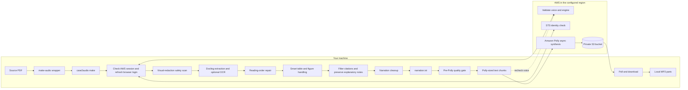

# case2audio

Turn layout-heavy PDFs into clean narration text, then optionally send that text to
Amazon Polly and download the MP3.

## Run it

```bash
./make-audio bb.pdf
```

Or process several PDFs with one command:

```bash
./make-audio bb.pdf sfn.pdf
```

Bare filenames default to `~/Downloads`, so this reads `~/Downloads/bb.pdf` and
`~/Downloads/sfn.pdf`. Explicit paths still work: `./bb.pdf` uses the current directory,
and `~/Documents/bb.pdf` or an absolute path uses that location. You can mix filenames and
explicit paths in one command. Quote filenames containing spaces, e.g. `"my case.pdf"`.

PDF extraction runs one at a time, but **up to two PDFs process through Polly concurrently**.
While Polly generates `bb.pdf`, the command extracts `sfn.pdf` and starts its audio job.
Results stay separate in `generated/bb/` and `generated/sfn/`. Use `--jobs 1` after the PDFs
for sequential processing, or `--jobs N` to change the concurrency limit.

Login is checked once before the batch. List all PDFs before shared options, such as
`--table-mode linearize`. All paths are checked up front; duplicate output names are rejected.
When a failure is detected, new jobs stop; already running jobs finish and download their outputs.
The command reports the failures and exits nonzero. Rerun only unfinished PDFs to avoid paying
for completed audio again.

Polly messages include local timestamps and PDF names, for example:

```text
[2026-09-07 16:15:03 EDT] [bb.pdf] Polly is processing part 1/1 (task ...).
[2026-09-07 16:15:25 EDT] [sfn.pdf] Polly is processing part 1/1 (task ...).
```

That's the normal command. No virtualenv activation or AWS flags needed. Defaults: Matthew,
Generative, and no OCR for selectable-text PDFs. AWS bucket, region, and profile come from
`.case2audio.env`.

The command checks AWS access **before extracting the PDF**. If your browser login has expired,
it runs `aws login --profile case2audio` (or the configured profile), opens the browser, and
continues after you sign in. SSO profiles use `aws sso login`. Polly progress messages show when
the task is submitted, processing, and downloading.

Recovery also handles AWS's `CreateOAuth2Token` invalid/expired authorization-grant error.
Valid sessions proceed without browser login; AWS can still require sign-in when a session
expires or is revoked.

The MP3 lands at `generated/bb/audio/part-001.mp3`; the reviewed text is
`generated/bb/narration.txt`. Documents over 95,000 characters produce ordered audio parts.

S3 audio uses the PDF name: `bb.pdf` becomes `s3://polly-gsk/case2audio/bb.mp3` and
`sfn.pdf` becomes `s3://polly-gsk/case2audio/sfn.mp3`. Longer documents use `bb-part-001.mp3`,
`bb-part-002.mp3`, etc. `--prefix` changes the `case2audio/` folder. A later successful run of
the same name replaces its readable S3 copy. Local files retain their existing `part-001.mp3`
layout. Polly's task-ID originals remain under `case2audio/_tasks/` for recovery; the Polly
task console still links to those originals.

```bash
./make-audio --ocr scanned-case.pdf    # Scanned/image-only PDF
./make-audio bb.pdf --table-mode linearize
./make-audio --dry-run bb.pdf sfn.pdf   # Show resolved paths/options without running
```

If you need to refresh the login manually:

```bash
aws login --profile case2audio
```

Use the profile from `.case2audio.env`. Bare `aws login` targets `default`, which may have
unrelated access keys. Automated runs print the correct login command instead of opening a
browser. Permission and network errors stop early with their actual cause.

## Setup on a new machine

Requires Python 3.12 and AWS CLI v2 with `aws login` support (`brew install python@3.12 awscli`
on macOS).

```bash
./scripts/bootstrap.sh
cp .case2audio.env.example .case2audio.env
```

Set the local config to your existing bucket and profile. For this setup:

```bash
CASE2AUDIO_BUCKET=polly-gsk
CASE2AUDIO_REGION=us-east-1
CASE2AUDIO_PROFILE=case2audio
```

On a fresh machine, run `aws login --profile case2audio` once, then use `./make-audio`.
The first extraction downloads Docling's models. The bucket must already exist in the same
region as Polly. Use an existing SSO profile if that is how your AWS account is configured.

Source PDFs, extracted text, and audio are ignored by Git so licensed course material does
not accidentally land on GitHub.

## Architecture

> **Maintenance note:** Keep this section and diagram updated whenever the data flow, local/AWS
> boundary, output layout, default voice or engine, or AWS requirements change.



The responsibilities are deliberately separated:

- `make-audio` loads the ignored local AWS configuration and invokes the installed CLI. It skips
  OCR by default because most source PDFs already contain selectable text. Multiple input paths
  form a batch: one session check, then the per-PDF flow below with separate outputs.
  Bare filenames resolve from `~/Downloads`; explicit paths keep their supplied location.
- Docling extraction and quality checks run sequentially on the main thread because of the native
  parser's threading constraints. A bounded worker pool overlaps Polly submission, polling, and
  downloads for up to `--jobs` PDFs (default 2). Workers share Polly/S3 clients created on the
  main thread, so credential refresh is coordinated instead of racing the same cached token.
  The SDK session preserves the AWS profile's login region; `CASE2AUDIO_REGION` selects only
  the service region for Polly, S3, and STS.
- `case2audio extract` runs entirely on the local machine. Docling reads the PDF, the reading-order
  layer repairs misplaced headings and moves real sidebars out of the main narrative, and the
  cleanup layer removes page furniture, duplicate headings, and other material that sounds bad
  when narrated.
- Before extraction, a local PDF safety scan replaces selectable text hidden under opaque black
  rectangles with `[redacted]` in the narration and every debug artifact.
- After reading-order repair, the citation filter removes source lists and citation-only notes
  from the narration stream, retaining explanations and leaving the raw extraction for reference.
- Smart exhibit handling narrates compact text tables, clearly marks dense numeric tables and
  substantial figures for visual review, and never silently drops them.
- The cleaned result and extraction diagnostics are written under `generated/<pdf-name>/` before
  any paid synthesis request is made. The quality report blocks known redaction or footer leaks.
- `case2audio speak` splits reviewed narration at safe paragraph or sentence boundaries, validates
  the selected voice/engine in the configured region, and starts asynchronous Polly tasks.
- Polly writes each completed MP3 to the private S3 bucket under `_tasks/`. The CLI polls the tasks,
  downloads the files into `generated/<pdf-name>/audio/`, then copies the S3 objects to readable
  PDF-based names. This copy uses existing audio and does not submit another synthesis task.
- `case2audio make` checks the configured AWS session and voice before extraction. An expired
  browser session triggers one login attempt for that same profile in an interactive terminal;
  it then creates a fresh SDK session and verifies access before continuing. `speak` checks
  access too; `extract` stays local. `case2audio doctor` only checks dependencies and AWS access.

Only cleaned narration is sent as synthesis content; the source PDF and Docling debug files stay
local. S3 objects remain in the private bucket until the account's own cleanup or retention policy
removes them.

## Extraction and output

```bash
.venv/bin/case2audio extract ~/Downloads/case.pdf --no-ocr --debug-dir generated/case/debug
```

This stays local and writes `generated/case.txt`. If a publisher's notice survives, inspect
`generated/case/debug/docling.md` and add a narrow rule:

```bash
./make-audio ~/Downloads/case.pdf \
  --drop-regex '^confidential course copy$'
```

The default `--table-mode smart` reads compact text-heavy tables but replaces dense numeric tables
with a clear spoken notice to review the PDF. Large figures get the same treatment. Use
`--table-mode skip` to omit every table's cells while retaining notices, or `--table-mode linearize`
to read every table row. The debug `quality-report.txt` records redactions, narrated tables, and
intentional visual-review notices before anything is sent to Polly.

Reference lists, bibliographies, endnote citations, citation-only footnotes, and exhibit source
lines are excluded from narration by default. Definitions, caveats, and explanatory notes are
kept; clearly marked explanations inside endnotes appear under `Explanatory notes`. Ambiguous
footnotes are retained rather than risking removal of useful case content. Inline citation numbers
that cannot be distinguished safely from real numbers may still appear.

Raw Docling Markdown/JSON retain the sources for review. The quality report records omitted
citation blocks and retained notes. Citation filtering always applies during PDF extraction.

Recognized copyright headings, copyright notices (including `©` year ranges), editorial-version
notices, teaching-use disclaimers, and reproduction-permission boilerplate are also omitted.
Cleanup removes notice sentences rather than whole sections, because PDF extraction can merge
the next real paragraph into a notice. Ordinary discussion of copyright and licensing is kept;
unfamiliar publisher wording may still need a targeted rule. Raw extraction retains the notices.
These rules affect future narration only; existing MP3s are not modified.

Results appear under `generated/your-case/`:

```text
generated/your-case/
├── narration.txt
├── debug/
│   ├── docling.md
│   ├── narration-order.md
│   ├── docling.json
│   └── quality-report.txt
└── audio/
    └── part-001.mp3
```

`part-001.mp3` is the complete audiobook for text under 95,000 characters. Longer documents
are split at paragraph and sentence boundaries into ordered files.

Sidebars detected from their heading and page geometry are moved to a final `Sidebars` section.
This keeps a box in the left column from interrupting an unfinished sentence in the main article.
Narrow headings without sidebar content stay where they appear in the document.

The pre-Polly quality gate stops synthesis if hidden redacted text or a known running-footer form
survives cleanup. Warnings about numeric tables and figures are non-blocking because the narration
contains explicit review notices instead of silently losing that material.

To synthesize previously reviewed text without extracting again:

```bash
.venv/bin/case2audio speak generated/case/narration.txt \
  --bucket polly-gsk --region us-east-1 --profile case2audio \
  --output-dir generated/case/audio
```

## AWS details

Uses the standard SDK credential chain. The bucket must be in the Polly region. Required
permissions include `polly:DescribeVoices`, `polly:StartSpeechSynthesisTask`,
`polly:GetSpeechSynthesisTask`, `s3:PutObject`, and `s3:GetObject` for the output bucket.
The initial session check calls `sts:GetCallerIdentity`.

Voice support varies by engine and region. To list valid choices:

```bash
aws polly describe-voices --engine generative --region us-east-1 --profile case2audio
```

The defaults are `Matthew` + `generative`, which AWS currently offers in `us-east-1` but not
`us-east-2`. Use a bucket in `us-east-1`, or explicitly pass `--engine standard` when staying
in `us-east-2`.

## Development

```bash
source .venv/bin/activate
pytest
ruff check .
```

After changing package code locally, rerun `python -m pip install --no-deps .` before testing the
installed `case2audio` command.

CI runs the fast unit tests and lint checks without downloading Docling models or calling AWS.
The AWS test uses fakes, so pull requests cannot create paid synthesis tasks.

## Reference docs

- [Docling basic usage](https://docling-project.github.io/docling/usage/)
- [Amazon Polly long audio tasks](https://docs.aws.amazon.com/polly/latest/dg/longer-console.html)
